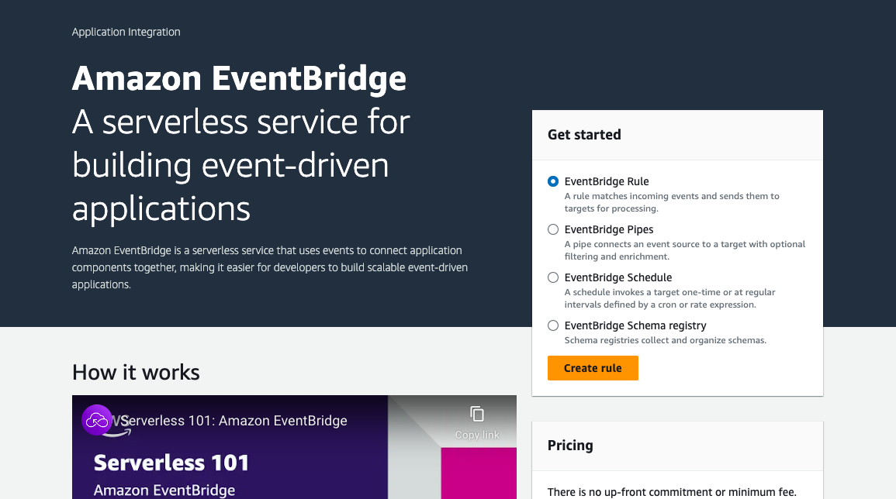
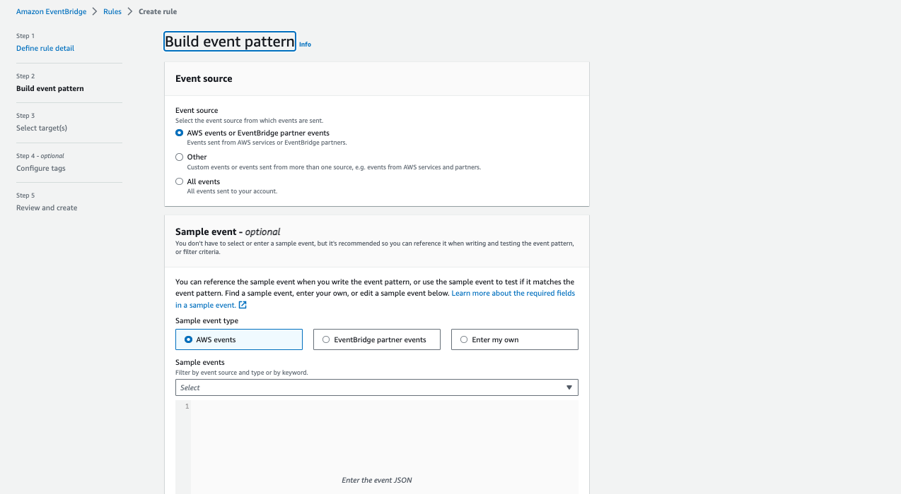
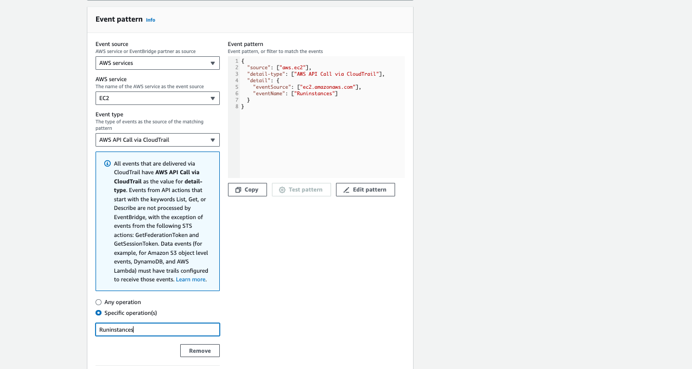

# AWS AUTOMATION WITH PYTHON

## Project 1: Automatically tagging every EC2 instances with the name of the ec2 creator

From the diagram above, the objective of this project.
1. When anyone creates an EC2 instance in our organisation
2. An EventBridge service is triggered which in turn runs a lambda function to extract all the information of the EC2 instance
3. Using some particula information from the data retrieved such as EC2 owner, the lambda function tagd the EC2 instance with the owner's name

## Create a Lambda function

## Create Test

## Create CloudTrial to identify logged in user

### Create S3 bucket & Role name

## Set Rules in the EventBridge

Here we select the lambda service and function

Complete

## Now the trigger has been added to our Lambda function
From:

To:

## [Python Boto3 AWS Boto3 url ](https://boto3.amazonaws.com/v1/documentation/api/latest/guide/quickstart.html)

[Automatically tag EC2 instance with the name of the owner](./auto_tag_ec2.py)